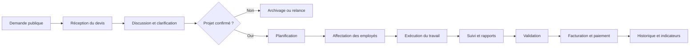

# Architecture globale — MKS Service

## 1. Positionnement du site

MKS Service est une plateforme métier intégrée pour une entreprise de services. Le site public présente l’entreprise et ses offres; les espaces connectés organisent les demandes clients, les collaborateurs, les ressources humaines, les finances et le pilotage administratif.

> La version livrée ici est une **interface frontend interactive et prête à être branchée à une API**. Elle formalise les écrans, les rôles, les flux et les contrôles; elle ne crée pas encore de comptes, de paiements ou de données persistantes.

## 2. Domaines fonctionnels

| Domaine | Rôle principal | Fonctions représentées |
|---|---|---|
| Site public | Visiteur | Présentation, services, demande de devis, informations, actualités, contact |
| Espace client | Client | Compte, demandes, devis, factures, messages, commandes, paiements, historique |
| Plateforme RH | Employé, RH, responsable | Employés, contrats, paie, présences, congés, évaluations, formations, affectations |
| Gestion financière | Admin comptable, admin principal | Entrées, sorties, trésorerie, rapprochements, prévisions et rapports |
| Espace employé | Employé | Profil, disponibilités, missions, état du travail, tâches, rapports, documents |
| Administration | Admin principal et admins secondaires | Supervision, domaines métier, permissions, audit, paramètres et statistiques |
| Communication | Tous selon leurs permissions | Discussions, groupes, pièces jointes, notifications et historique |

## 3. Modèle de rôles

Le rôle est déterminé côté serveur dans une future API. L’interface ne doit jamais être considérée comme une barrière de sécurité. Les permissions devront être vérifiées à chaque requête sur le backend.

| Rôle | Portée recommandée |
|---|---|
| Visiteur | Lecture du site public et soumission contrôlée d’une demande |
| Client | Ses propres demandes, devis, factures, messages et paiements |
| Employé | Son profil, ses tâches, ses disponibilités et ses rapports |
| Responsable de domaine | Équipe affectée, tâches, disponibilité, validation des rapports |
| Admin comptable | Entrées, sorties, rapprochements, prévisions et rapports financiers |
| Admin secondaire | Un ou plusieurs domaines explicitement attribués |
| Admin principal | Vue consolidée, gestion des rôles, audit et paramètres globaux |
| Système | Jobs, notifications, sauvegardes et journalisation technique |

## 4. Flux métier central



## 5. Échanges entre plateformes

Le site principal, la plateforme RH et le module financier devront communiquer via une API versionnée. Les échanges sensibles devront être authentifiés, tracés et limités au périmètre du rôle.

```text
Site public / Client
        │ demandes, devis, commandes, paiements
        ▼
API MKS Service ─────── API RH ─────── Employés, contrats, planning, rapports
        │
        └────────────── API Finance ─── Entrées, sorties, trésorerie, rapports
```

## 6. Sécurité attendue pour la version backend

L’API devra utiliser une authentification forte, des mots de passe hachés, des sessions ou jetons courts, une autorisation par rôle et domaine, une validation stricte des entrées, une protection anti-abus, le chiffrement TLS, la journalisation des actions sensibles et des sauvegardes vérifiées. Les pièces jointes devront être stockées dans un espace privé avec des URLs temporaires.

La version frontend fournie prépare ces contrôles dans l’interface : badges de rôle, panneau de contrôle, journalisation visuelle, section sécurité et séparation explicite des domaines. Ces éléments restent des représentations tant qu’aucun backend n’est connecté.

## 7. Structure frontend

| Chemin | Responsabilité |
|---|---|
| `client/src/pages/Home.tsx` | Page MKS Service, architecture interactive et présentation des espaces |
| `client/src/App.tsx` | Route principale et shell React |
| `client/src/index.css` | Design tokens, responsive, composants visuels et animations |
| `docs/ARCHITECTURE_MKS_SERVICE.md` | Architecture fonctionnelle et limites |
| `docs/DEPLOYMENT.md` | Préparation du déploiement statique |
| `client/public/` | Fichiers légers comme favicon, manifest et robots.txt |

## 8. Évolution recommandée

La prochaine étape technique consiste à ajouter une API backend séparée avec PostgreSQL, un fournisseur d’authentification et un stockage privé. Il faudra ensuite remplacer les données de démonstration par des requêtes côté serveur, ajouter des tests de permissions et connecter les workflows de devis, RH et finance.

## 9. Catalogue de prestations et demandes de devis

Les responsables de domaine et l’admin principal peuvent publier une prestation composée d’un identifiant, d’un titre, d’un domaine, d’une description, d’un libellé de prix, d’un auteur et d’un statut de publication. Une prestation publiée est visible sur la page publique et possède un bouton « Demander un devis ».

Le visiteur non connecté est envoyé vers l’inscription ou la connexion avec la prestation mémorisée. Après authentification, le client retrouve la prestation choisie dans son espace et peut envoyer sa demande. En production, le serveur devra contrôler que l’utilisateur possède un rôle client, que la prestation est publiée et que les permissions de publication appartiennent au responsable du domaine ou à l’admin principal.

Dans la démonstration frontend, les prestations sont conservées dans `localStorage` pour rendre le parcours visible immédiatement. Cette persistance doit être remplacée par des tables PostgreSQL et des routes API authentifiées avant toute utilisation métier.

## 10. Fonctionnalités actuellement implémentées dans le prototype

La page publique expose un catalogue de prestations publiées, une recherche instantanée par titre, domaine ou description et des filtres par catégorie. Chaque prestation possède une action « Demander un devis ». Lorsqu’un visiteur n’est pas connecté, le choix de la prestation est conservé avant la redirection vers l’inscription ou la connexion.

L’espace client affiche les demandes enregistrées, leurs compteurs par statut et un tableau de suivi. Une demande est cliquable afin d’afficher son détail complet : prestation, catégorie, message, budget, date et statut. Le tableau peut être trié par date croissante, date décroissante ou statut.

Les responsables de domaine et les administrateurs voient les demandes à traiter dans leur espace interne. Ils peuvent exécuter les actions « Valider » et « Refuser »; le nouveau statut est immédiatement répercuté dans l’espace client du prototype.

## 11. Structure frontend actuelle

| Chemin | Responsabilité |
|---|---|
| `client/src/pages/Home.tsx` | Accueil public, catalogue, recherche, filtres et lancement d’une demande |
| `client/src/pages/Access.tsx` | Connexion, inscription, espace client, détail/tri des devis et espaces admin |
| `client/src/lib/catalog.ts` | Modèles `ServiceItem` et `QuoteRequest`, stockage et mise à jour des statuts |
| `client/src/App.tsx` | Routage public, client et espaces internes par hash |
| `client/src/index.css` | Design system, responsive, états de chargement et confirmations |
| `docs/ARCHITECTURE_MKS_SERVICE.md` | Architecture fonctionnelle, flux, rôles et limites |
| `docs/DEPLOYMENT.md` | Installation, build et déploiement |

## 12. Limites importantes du prototype

La version actuelle stocke les prestations, la session et les demandes dans `localStorage` ou `sessionStorage`. Les hashes ne sont pas des mécanismes de sécurité et les validations admin ne sont pas encore protégées par une permission serveur. Pour la production, il faut remplacer cette logique par une API authentifiée, PostgreSQL, des rôles vérifiés côté serveur, une journalisation et un système d’e-mails transactionnels pour notifier les changements de statut.
